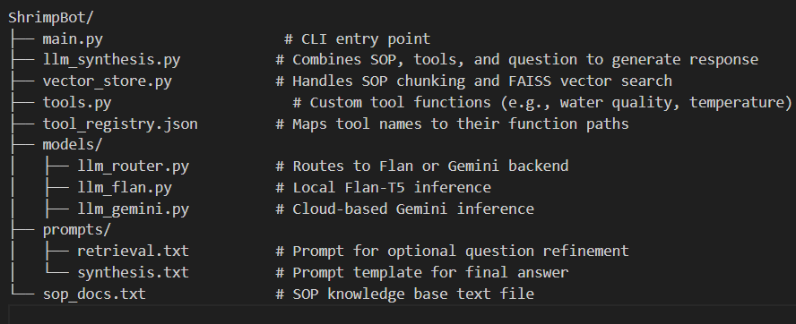

# 🦐 ShrimpBot – Hatchery SOP Assistant

ShrimpBot is an interactive terminal-based AI assistant that answers questions related to shrimp hatchery Standard Operating Procedures (SOPs). It combines retrieval-augmented generation (RAG), domain-specific tools, and LLMs (Flan-T5 or Gemini) to provide accurate and actionable responses.

---

## 📌 Features

- 🔍 **Contextual SOP Retrieval** using FAISS & MiniLM  
- ⚙️ **Keyword-based Tool Routing** for specialized insights  
- 🧠 **LLM-Powered Response Synthesis** (local or cloud)  
- 🔁 Supports Flan-T5 (local) and Gemini (cloud) inference  
- 💬 Easy-to-use CLI chatbot interface  

---

## 🗂️ Project Structure

---

## 🚀 How It Works

1. **User Query:** You ask a question in the terminal.  
2. **main.py:** Handles input/output and calls the generation function.  
3. **llm_synthesis.py:**  
   - Retrieves relevant SOP chunks from FAISS.  
   - Calls relevant tools based on keywords.  
   - Sends all inputs to the selected LLM backend.  
4. **LLM Inference:**  
   - Either `models/llm_flan.py` (local) or `models/llm_gemini.py` (cloud).  
5. **Response:** The synthesized answer is displayed with timing info.

---

## 🧠 Model Selection and Evaluation Note

1. For local inference, I used `google/flan-t5-base`, suitable for my system (8GB RAM, Intel i3 11th Gen @ 3.00GHz).  
2. I tested larger models like Mistral 7B and Microsoft Phi-2, but they couldn’t run due to hardware constraints.  
3. To validate both functionality and quality, I integrated Gemini as a cloud-based LLM backend.  
4. Both Flan-T5 and Gemini were tested to ensure smooth end-to-end performance.

---

## 💡 Future Improvements

- 🚀 Use 4-bit or 8-bit quantized models to run larger LLMs locally    
- 🖥️ Upgrade to 16–32 GB RAM + GPU to handle larger models efficiently
